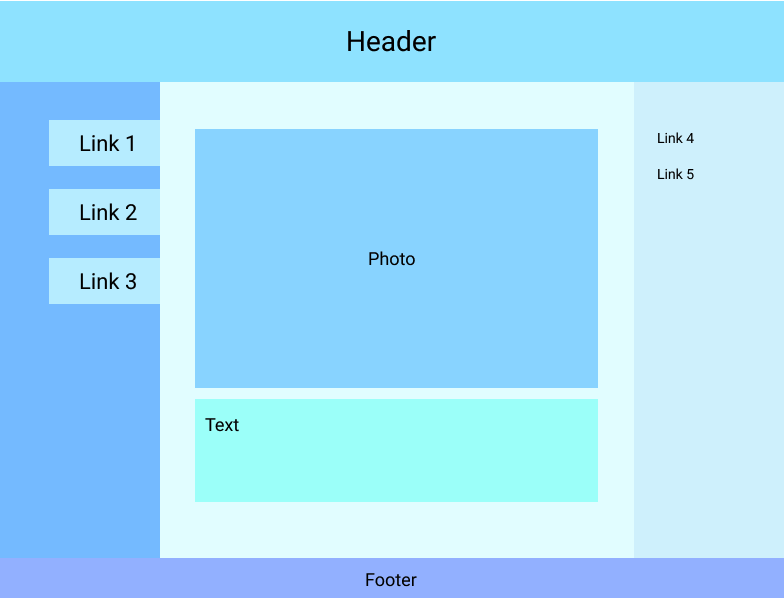

# DSL for Generating HTML Template

This DSL uses a declarative syntax to help you quickly generate an HTML template!
All you need to do is to specify your layout structure and customize our pre-defined
components.

## Demo time

For generating an HTML template like this:



the syntax in our DSL would look similar to this:

```
Page {
    [newHeader]
    [leftNav main rightNav]
    [Footer]
}

newHeader   = Header(title="Header", background="blue")
leftNav     = Nav(background=”#80C2FF”)
rightNav    = Nav(size="small", align="left", background=”#D4F2FC”)

leftNav {
    [Link(title="Link 1", ref="/...")]
    [Link(title="Link 2", ref="/...")]
    [Link(title="Link 3", ref="/...")]
}

rightNav {
    [Link(title="Link 4", ref="/...", backgroud="none")]
    [Link(title="Link 5", ref="/...", backgroud="none")]
}

main = Content()
main {
    [Box {
        [Image(src="...")]
        [Text(text="...")]
    }]
}

```

## Explanation

There are two types exist in our language, one is `layout` and another is `component`.

- Layouts define how components are going to render on a page,
so if components are surrounded by `[]`, they will be rendered in the same line. You can use syntax like `page{...}` to
specify layout structures inside a layout.

- Components are commonly used web components constructor, for example, navbar, button, link. When constructing them, you can use syntax like `button(size="small")` to customize your components.

## Temp EBNF

This is the ENNF we defined so far.

```
EBNF
    PROGRAM     ::= (ASSIGNMENT)* (LAYOUT)+
    ASSIGNMENT  ::= VAR “=” VALUE
    VAR         ::= CHAR(CHAR | NUMBER | ” _”)*
    STRING      ::= \” CHAR(CHAR)* \”
    CHAR        ::= “a”-”z” | “A”-”Z”
    VALUE       ::= STRING | NUMBER | CONSTRUCTOR | VAR
    CONSTRUCTOR ::= FUNCNAME | FUNCNAME “(” ASSIGNMENT (, ASSIGNMENT)*  “)”
    FUNCNAME    ::= “Nav” | “Header” | “Content” | “Link” | “Image” | “Video” | “Footer” | “Button”
    LAYOUT ::= (VAR | “Page”) “{“ ROW(ROW)* “}”
    ROW ::= "[" (VAR | CONSTRUCTOR) (“\s” (VAR | CONSTRUCTOR))* "]"
```
