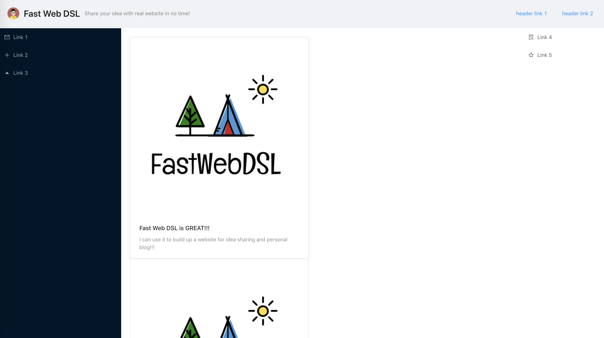

# DSL for Generating HTML Template

This DSL uses a declarative syntax to help you quickly generate an HTML template!
All you need to do is to specify your layout structure and customize our pre-defined
components.

## Demo time

For generating an HTML template like this:



the syntax in our DSL would look similar to this:

```
Page {
    [newHeader]
    [leftNav content rightNav]
    [Footer()]
}

newHeader = Header(
    title="Fast Web DSL",
    subtitle="Share your idea with real website in no time!",
    icon="https://avatars1.githubusercontent.com/u/8186664?s=460&v=4"
)

newHeader {
    [
        Link(text="header link 1", to="https://github.com/Raymond-yao/FastWebDSL")
        Link(text="header link 2", to="https://github.com/Raymond-yao/FastWebDSL")
    ]
}

leftNav   = Nav(size="large")
rightNav  = Nav(theme="light")

leftNav {
    [Link(text="Link 1", to="https://github.com/Raymond-yao/FastWebDSL")]
    [Link(text="Link 2", to="https://github.com/Raymond-yao/FastWebDSL")]
    [Link(text="Link 3", to="https://github.com/Raymond-yao/FastWebDSL")]
}

rightNav {
    [Link(text="Link 4", to="https://github.com/Raymond-yao/FastWebDSL")]
    [Link(text="Link 5", to="https://github.com/Raymond-yao/FastWebDSL")]
}

post = Post(
    title="Fast Web DSL is GREAT!!!",
    content="I can use it to build up a website for idea sharing and personal blog!!!"
)

content = Content()
content {
    [post Post()]
}

```

## Explanation

There are two types exist in our language, one is `layout` and another is `component`.

- Layouts define how components are going to render on a page,
so if components are surrounded by `[]`, they will be rendered in the same row.

- Components are commonly used web components constructor, for example, navbar, button, link. When constructing them, you can use syntax like `button(size="small")` to customize your components.

## Temp EBNF

This is the EBNF we defined so far.

```
EBNF
    PROGRAM     ::= (ASSIGNMENT)* (LAYOUT)+
    ASSIGNMENT  ::= VAR “=” (VALUE | CONSTRUCTOR)
    VAR         ::= CHAR(CHAR | NUMBER | ” _”)*
    STRING      ::= \” CHAR(CHAR)* \”
    CHAR        ::= “a”-”z” | “A”-”Z”
    VALUE       ::= STRING | NUMBER | VAR
    CONSTRUCTOR ::= FUNCNAME | FUNCNAME “(” ASSIGNMENT (, ASSIGNMENT)*  “)”
    FUNCNAME    ::= “Nav” | “Header” | “Content” | “Link” | “Image” | “Post” | “Footer” | “Text”
    LAYOUT      ::= (VAR | “Page”) “{“ ROW(ROW)* “}”
    ROW         ::= "[" (VAR | CONSTRUCTOR) (“\s” (VAR | CONSTRUCTOR))* "]"
```

## Dev Notes

Run `./test.sh` script to see code coverage.

Run `./demo.sh` script to host a sample project generated by our DSL for demo purposes.

For manual test, include env variable `DEBUG="not empty"` to enable test debug level log. E.g. `DEBUG="not empty" ./test.sh`
